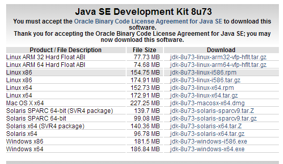
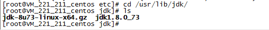
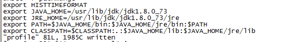
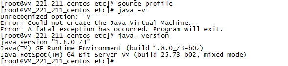

## Step One: 下载JDK

官网下载地址：http://www.oracle.com/technetwork/java/javase/downloads/jdk8-downloads-2133151.html

可以根据自己的系统下载对应的JDK版本。

这里我的下载的是：jdk-8u73-linux-x64.gz

## Step Two: 上传并解压安装包

1. `mkdir jdk`：在`/usr/lib`目录下新建文件夹`jdk`
2. 将文件上传到该目录下，使用rz命令。([如何安装rz](#install-rz))
3. `cd jdk`，使用`tar -zxvf jdk-8u73-linux-x64.gz`解压，可以看到文件列表如下：

## Step Three: 配置环境变量

1. `vim /etc/profile`：编辑配置文件
2. 在文件的最后面增加：

	

3. 保存后使用`source profile`使配置立即生效
4. `java -v`查看是否成功配置
	
	

## Install rz

CentOS 下使用 `yum install lrzsz`